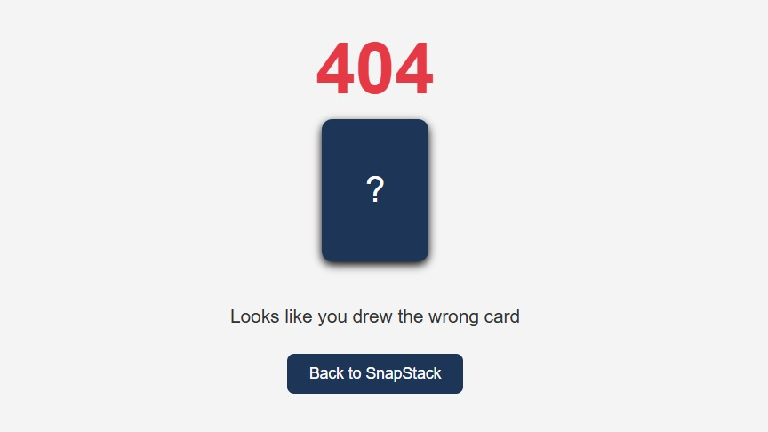
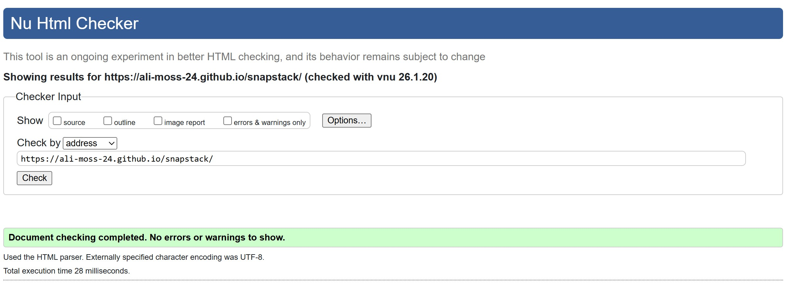
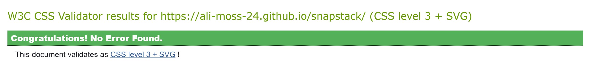

# SnapStack - Project Overview

SnapStack is a fast‑paced, colour‑matching card game built with HTML, CSS, and JavaScript. Players draw and play cards to match the colour or number of the top card in the discard pile. The goal is simple: clear your hand before the deck runs out.

This project was created as part of the Code Institute’s Front-End Development curriculum.

Below is the main game interface showing the discard pile, player hand, and controls:

---

### ⭐ User Stories

**New Visitor**

As a new visitor, I want to ...
- Understand the purpose of the game quickly so I know how to play.
- Navigate easily between Home, Play and Rules so I can find what I need.
- See clear instructions so I can start playing without confusion.

**Returning Visitor Goals**

As a returning visitor, I want to ...
- Jump straight into the game so I can play again quickly.
- Reset the game easily so I can start a new round.
- Enjoy a smooth, responsive experience on any device.

**Frequent Player Goals**

As a frequent player, I want to ...
- Have fast, intuitive controls so gameplay feels smooth.
- Receive clear feedback when I make a valid or invalid move.
- Track my progress by clearing my hand and seeing the win message.

**Site Owner Goals**

As the owner, I want to ...
- Provide a simple, fun card game that demonstrates my JavaScript skills.
- Showcase clean UI design and responsive layout.
- Ensure the game works reliably so users have a positive experience.

---

### 🎮 Features 

- Dynamic card deck generated with JavaScript
- Shuffle, draw and play mechanics
- Color and number matching rules
- Interactive UI with clickable cards
- Responsive layout
- Clear visual feedback for valid and invalid moves
- Win conditions when the player's hand reaches zero
- Reset button to restart the game instantly

### ⭐ Addition Features

**Custom 404 Page**

A themed 404.html file has been added to handle invalid or broken URLs. The design matches the SnapStack color palette and includes a playful "wrong card" message, along with a clear button that returns users to the main game. This provides a more polished and user-friendly experience when navigating to non-existent routes.

[Live 404 page](https://ali-moss-24.github.io/snapstack/thispagedoesnotexist)

---

### 🚧 Features left to Implement

- **Sound Effects:**   
 Add audio feedback for drawing cards, invalid moves, and winning the game.
 - **Score Tracking:**  
 Track how many rounds the player wins and display a running score.
 - **Timer Mode:**  
 Introduce a timed challenge where players must clear their hand before the timer runs out.
 - **Animations:**  
 Smooth animation for drawing and playing cards to enhance the visual experience.
 - **Multiplayer Mode:**  
 Allow two players to take turns using the same device or online.
- **Card Draw Limit:**  
Add an optional rule where the deck has a maximum number of draws.
- **Difficulty Levels:**  
Introduce different rule sets or deck variations for easy/medium/hard modes

---

### 🛠️ Technologies used

- HTML
- CSS
- JavaScript

---

### 🧩 How to play

- You begin with one card on the discard pile and an empty hand.
- Click **Draw Card** to add a card to your hand.
- Click a card in your hand to play it.
- You may only play a card if it matches the **colour** or **number** of the top discard card.
- Invalid moves trigger a notification.
- Continue drawing and playing until your hand is empty - then you win.
- Use **Reset Game** to start a new round at any time.

---

### 🧪 Testing

**Testing Strategy**

Testing was carried out throughout the entire development process rather than left until the end. Each feature was tested as soon as it was implemented, and retested after styling changes or code updates. Once the project was deployed to GitHub, all tests were repeated to ensure the live version behaved exactly the same as the development version. This approach helped catch issues early and ensured a smooth final experience.

**Automated vs Manual Testing**

Both automated and manual testing were used during development:

- **Manual testing** involved interacting with the game directly to check gameplay behaviour, button functionality, layout, and responsiveness. This includes trying valid and invalid moves, resetting the game, and testing navigation links.
- **Automated testing** was carried out using online tools such as W3C HTML Validator, CSS Jigsaw Validator, and Lighthouse. These tools automatically checked the code for errors, accessibility issues, performance, and best practices.

Using both methods ensured the game worked correctly from a user's perspective while also meeting technical standards for accessibility and performance.

**Testing Procedures**

The game was tested on desktop and mobile to make sure everything worked properly. Each feature was checked on its own and then tested again together. Once the site was live, all tests were repeated to make sure nothing broke during deployment.

**Feature Testing**

| Feature | Expected Result | Test Performed | Outcome |
|--------|-----------------|----------------|---------|
| Page loads | Game UI displays with no errors | Opened site in browser | Passed |
| Draw Card button | Adds a card to the hand | Clicked Draw repeatedly | Passed |
| Play card | Valid card plays onto discard pile | Clicked matching card | Passed |
| Invalid move | Alert appears | Clicked non‑matching card | Passed |
| Discard pile updates | Top card changes after play | Played multiple cards | Passed |
| Win condition | Alert appears when hand is empty | Played until hand cleared | Passed |
| Reset button | Game restarts, hand clears | Clicked Reset | Passed |
| Navigation links | Scroll to correct section | Clicked Home / Play / Rules | Passed |
| Responsive layout | Layout adjusts on mobile | Tested on phone + dev tools | Passed |

**Screenshots Aligned to User Stories**

Screenshots in the README help to show how the final game matches the user stories - things like understanding the layout, checking the rules, and using the main controls. They give a clear picture of how the game works in practice and show that the design decisions made during planning were carried through to the finished version.

**Browser Compatibility**

The site was tested using Google Chrome.
Additional browser environments and screen sizes were simulated using Chrome DevTools.
No layout or functionality issues were observed during testing.

**Bugs & Fixes**

- **Bug:** Reset button didn't clear the hand.  
**Fix:** Added *playerHand = []* inside reset event listener

- **Bug:** Discard pile didn't update after playing a card.  
**Fix:** Added *updateTopCard()* after pushing the played card.

- **Bug:** Invalid move alert triggered even when clicking a valid card.  
**Fix:** Corrected matching logic in *playCard()*.

**Bug Evaluation**

All the bugs found during development were fixed, and retesting showed that everything worked properly across different devices. There are no major issues left. Any small things that are still missing - like sound effects or animations - are planned as future improvements rather than problems with the game.

**Validator Testing**

- HTML validated with W3C

- CSS validated with Jigsaw

- Lighthouse used to assess performance, accessibility, best practices, and SEO

**Lighthouse Results**

Lighthouse audits were run on the deployment site to check performance, accessibility, best practices, and SEO.

- Performance: 100
- Accessibility: 95
- Best Practices: 100
- SEO: 90

These results show that the site loads quickly, follows modern standards, and is easy to use. A few minor accessibility suggestions were flagged, but nothing that would affect gameplay or usability.

Below is the Lighthouse report summary:

**Testing Summary**

All core features worked smoothly across devices and browsers. No blocking issues were found, and the game performed reliably throughout testing. The combination of manual testing, validator tools, and Lighthouse audits confirmed that the final version works reliably and as intended.

---

### 🎨 UX & Design

**UX Overview**

SnapStack was designed to feel simple, welcoming, and easy to use from the moment a player lands on the page. The interface avoids clutter and keeps the focus on the cards and the main controls, so players can understand how to play without needing instructions first. Everything is laid out clearly, with the most important elements placed where the eye naturally goes, creating a smooth and enjoyable experience for new and returning players. These choices were made to keep the experience simple, intuitive, and enjoyable for players of all experience levels.

**Accessibility Considerations**

Accessibility was considered from the beginning to make sure the game is clear, readable, and comfortable for anyone who wants to play. The following choices were made to support a wide range of players and devices:

- High-contrast colors so card values and buttons are easy to see
- Large, clearly labelled buttons that work well on both desktop and mobile
- Alt text on all images
- HTML arranged clearly so assistive tools can read it properly
- Keyboard-friendly controls that adapt smoothly to different screen sizes
- Clear feedback messages for invalid moves

These decisions help ensure the game remains accessible and easy to understand, and enjoyable to interact with.

**Navigation & Layout Decisions**

Even though SnapStack is a single player game, navigation still plays an important role in guiding the user:

- The **Home**, **Play**, and **Rules** links let the user jump straight to what they need.
- The **discard pile** sits at the top of the screen, making it the first thing players see.
- The **player hand** is centred so it's always easy to reach and interact with.
- The **Draw** and **Reset** buttons are grouped together to keep actions predictable.
- The **Rules** section is placed at the bottom, following a natural flow for new players.

This structure keeps the experience intuitive and prevents users from feeling lost or overwhelmed.

**Color Palette**

To create a bright, accessible game environment

- 🔴 #e63946 (red)
- 🔵 #457b9d (blue)
- 🟢 #2a9d8f (green)
- 🟡 #e9c46a (yellow)

These colors offer strong contrast and clear visual grouping.

**Wireframe**

The following wireframe was created by me using Figma to plan the layout and user flow of the SnapStack game interface. It outlines the key sections of the game: the discard pile, player hand, control buttons, and rules area.

- Discard pile at the top
- Player hand in the centre
- Draw and reset buttons grouped together
- Rules section at the bottom

**Design Rationale**

- Large buttons and generous spacing reduce mis-clicks and improve usability on touch devices.
- Color-coded cards make the matching rules instantly clear without needing to read text.
- A clean, minimal interface keeps the focus on gameplay rather than decoration.
- The layout mirrors familiar card-game setups, helping players understand the flow quickly.
- Consistent styling across all elements creates a polished, cohesive experience.

---

### 🚀 Deployment

**Live Link:**

[View Live Website](https://ali-moss-24.github.io/snapstack/)

**Repository:**

[View Repository](https://github.com/ali-moss-24/snapstack)

Deployment steps:

1. Push all code to GitHub.
2. Go to **Settings → Pages.**
3. Select **main branch** and save
4. Wait for the site to build.

The deployment process was repeated after major updates to ensure the live version always matched the development version.

**404 page**

A custom 404.html file is included in the root directory of the project. GitHub Pages automatically serves this file whenever a user visits a route that does not exist. The page is styled to match the SnapStack theme and includes a direct link to the homepage.

**Reflection**

Working on SnapStack really helped me grow my JavaScript confidence, especially with things like event handling, updating the DOM, and figuring out bugs as they appeared. I also learned how valuable it is to test features as I go, rather than waiting till the end. It made the whole process much smoother. Designing the layout and color scheme showed me how much small UI choices can change the feel of a game. Deploying to GitHub Pages also taught me how the live version can behave slightly differently from the local one, and how important it is to check everything again after publishing. Overall, this project helped me build both my technical skills and my design instincts, and I'm proud of how it all came together.

---
### Credits

- All code written by me (Alison Mossop)
- Game concept inspired by **UNO** 
- Troubleshooting advice gained from Microsoft Copilot
