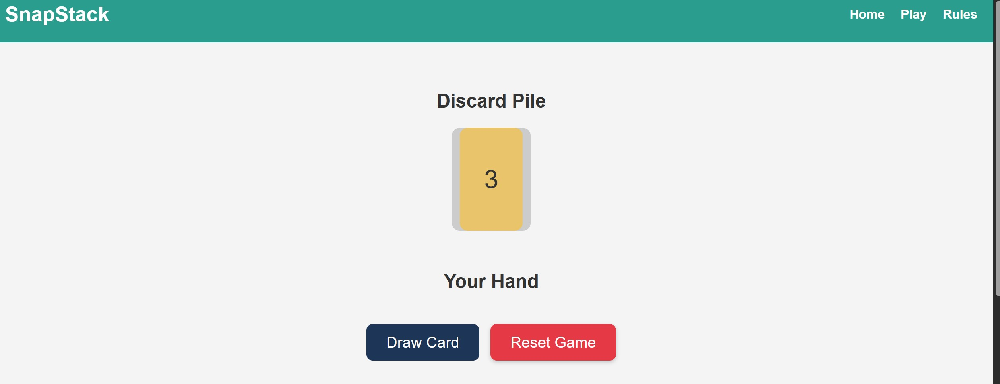
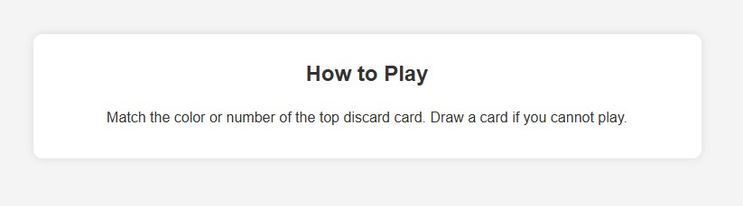
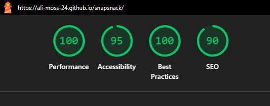
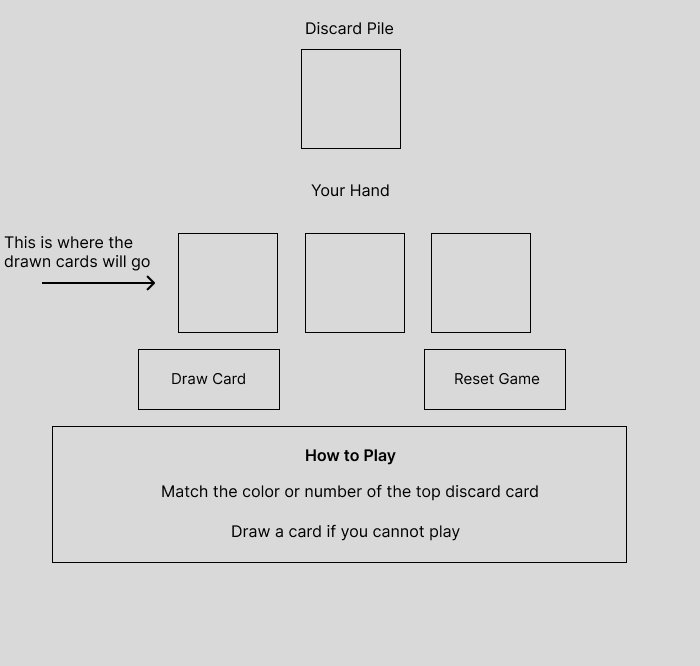

# SnapStack - Project Overview

SnapStack is a fast‑paced, colour‑matching card game built with HTML, CSS, and JavaScript. Players draw and play cards to match the colour or number of the top card in the discard pile. The goal is simple: clear your hand before the deck runs out.

This project was created as part of the Code Institute’s Front-End Development curriculum.

Below is the main game interface showing the discard pile, player hand, and controls:

---

### ⭐ User Stories

**New Visitor**

As a new visitor, I want to ...
- Understand the purpose of the game quickly so I know how to play.
- Navigate easily between Home, Play and Rules so I can find what I need.
- See clear instructions so I can start playing without confusion.

**Returning Visitor Goals**

As a returning visitor, I want to ...
- Jump straight into the game so I can play again quickly.
- Reset the game easily so I can start a new round.
- Enjoy a smooth, responsive experience on any device.

**Frequent Player Goals**

As a frequent player, I want to ...
- Have fast, intuitive controls so gameplay feels smooth.
- Receive clear feedback when I make a valid or invalid move.
- Track my progress by clearing my hand and seeing the win message.

**Site Owner Goals**

As the owner, I want to ...
- Provide a simple, fun card game that demonstrates my JavaScript skills.
- Showcase clean UI design and responsive layout.
- Ensure the game works reliably so users have a positive experience.

---

### 🎮 Features 

- Dynamic card deck generated with JavaScript
- Shuffle, draw and play mechanics
- Color and number matching rules
- Interactive UI with clickable cards
- Responsive layout
- Clear visual feedback for valid and invalid moves
- Win conditions when the player's hand reaches zero
- Reset button to restart the game instantly

---

### 🚧 Features left to Implement

- **Sound Effects:**   
 Add audio feedback for drawing cards, invalid moves, and winning the game.
 - **Score Tracking:**  
 Track how many rounds the player wins and display a running score.
 - **Timer Mode:**  
 Introduce a timed challenge where players must clear their hand before the timer runs out.
 - **Animations:**  
 Smooth animation for drawing and playing cards to enhance the visual experience.
 - **Multiplayer Mode:**  
 Allow two players to take turns using the same device or online.
- **Card Draw Limit:**  
Add an optional rule where the deck has a maximum number of draws.
- **Difficulty Levels:**  
Introduce different rule sets or deck variations for easy/medium/hard modes

---

### 🛠️ Technologies used

- HTML
- CSS
- JavaScript

---

### 🧩 How to play

- You begin with one card on the discard pile and an empty hand.
- Click **Draw Card** to add a card to your hand.
- Click a card in your hand to play it.
- You may only play a card if it matches the **colour** or **number** of the top discard card.
- Invalid moves trigger a notification.
- Continue drawing and playing until your hand is empty - then you win.
- Use **Reset Game** to start a new round at any time.

---

### 🧪 Testing

**Feature Testing**

| Feature | Expected Result | Test Performed | Outcome |
|--------|-----------------|----------------|---------|
| Page loads | Game UI displays with no errors | Opened site in browser | Passed |
| Draw Card button | Adds a card to the hand | Clicked Draw repeatedly | Passed |
| Play card | Valid card plays onto discard pile | Clicked matching card | Passed |
| Invalid move | Alert appears | Clicked non‑matching card | Passed |
| Discard pile updates | Top card changes after play | Played multiple cards | Passed |
| Win condition | Alert appears when hand is empty | Played until hand cleared | Passed |
| Reset button | Game restarts, hand clears | Clicked Reset | Passed |
| Navigation links | Scroll to correct section | Clicked Home / Play / Rules | Passed |
| Responsive layout | Layout adjusts on mobile | Tested on phone + dev tools | Passed |

**Browser Compatibility**

The site was tested using Google Chrome.
Additional browser environments and screen sizes were simulated using Chrome DevTools.
No layout or functionality issues were observed during testing.

**Bugs & Fixes**

- **Bug:** Reset button didn't clear the hand.  
**Fix:** Added *playerHand = []* inside reset event listener

- **Bug:** Discard pile didn't update after playing a card.  
**Fix:** Added *updateTopCard()* after pushing the played card.

- **Bug:** Invalid move alert triggered even when clicking a valid card.  
**Fix:** Corrected matching logic in *playCard()*.

**Validator Testing**

- HTML validated with W3C
- CSS validated with Jigsaw
- JavaScript checked with linter

**Lighthouse Testing**

Lighthouse audits were run on the deployment site using Google Chrome DevTools to assess performance, accessibility, best practises, and SEO.

- Performance: 100
- Accessibility: 95
- Best Practices: 100
- SEO: 90

These scores show that the site loads efficiently, follows modern development standards, and is fully accessible and discoverable by search engines. Minor accessibilty suggestions were flagged, but no critical issues were found.

Below is the Lighthouse report summary:

**Testing Summary**

All core features performed as expected across devices and browsers. No bugs were found during testing, and the game behaves reliably under normal use.

---

### 🎨 UX & Design

**Color Palette**

To create a bright, accessible game environment

- 🔴 #e63946 (red)
- 🔵 #457b9d (blue)
- 🟢 #2a9d8f (green)
- 🟡 #e9c46a (yellow)

These colors offer strong contrast and clear visual grouping.

**Wireframe**

The following wireframe was created to plan the layout and user flow of the SnapStack game interface. It outlines the key sections of the game: the discard pile, player hand, control buttons, and rules area.

- Discard pile at the top
- Player hand in the centre
- Draw and reset buttons grouped together
- Rules section at the bottom

**Design Rationale**

- Large buttons and clear spacing improve accessibility
- Color-coded cards make gameplay intuitive
- Layout prioritises the discard pile and player hand
- Navigation is simple: Home → Play → Rules
- Clean, minimal UI to keep focus on gameplay

---

### 🚀 Deployment

**Live Link:**

[View Live Website](https://ali-moss-24.github.io/snapsnack/)

**Repository:**

[View Repository](https://github.com/ali-moss-24/snapsnack)

Deployment steps:

1. Push all code to GitHub.
2. Go to **Settings → Pages.**
3. Select **main branch** and save
4. Wait for the site to build.

---
### Credits

- All code written by me (Alison Mossop)
- Game concept inspired by **UNO** 

